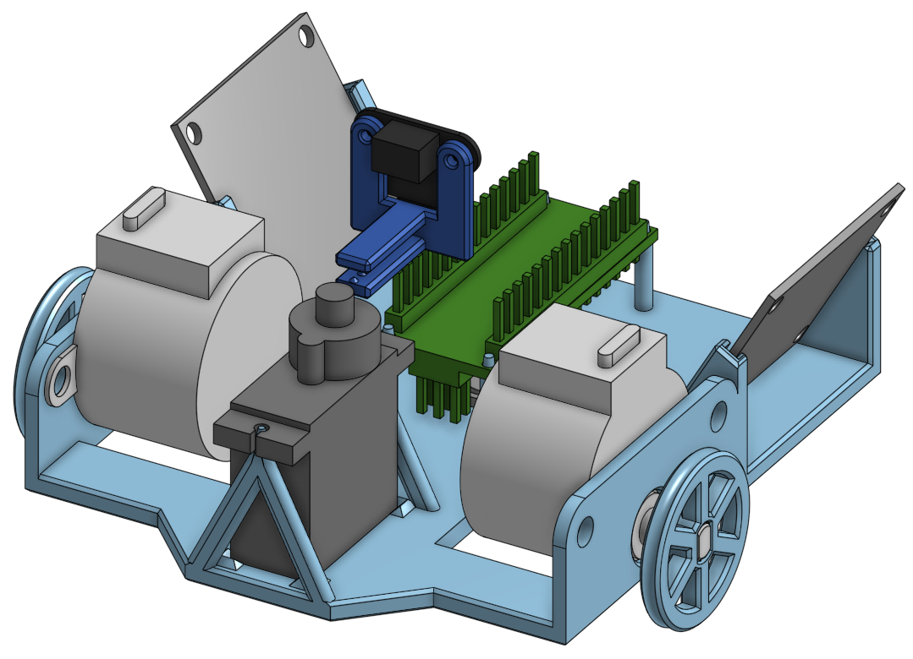

# Mapping Robot

This repository contains the code for a mapping robot.
Most functionality is written in TypeScript, including a simulation.
There is also a C++ program for an Arduino, which enables the TypeScript program to use an actual robot by connecting over USB-Serial.

The main TypeScript program is located in the `src` directory.
The C++ Arduino program can be found in the `arduino/robot` directory.

You can try out the TypeScript program at https://daniel-michel.github.io/mapping-robot/.

## Running the Program

The TypeScript program can either be accessed at https://daniel-michel.github.io/mapping-robot/ or run locally by cloning the repository, running `npm run dev` in the root directory, and opening the shown URL in your browser.

To use the physical robot, you first need to set up the hardware as described below (including uploading the Arduino program).
Then you can connect the Arduino over USB.
Now you can use the TypeScript program and click on `Use Physical Robot` and `Connect Robot` to establish a connection. Make sure to use a [browser that supports the Web Serial API](https://caniuse.com/web-serial).

> If, for some reason, when clicking `Connect Robot` no devices are found, you might want to try removing the filters at [arduino-robot.ts:124](./src/logic/robot/arduino-robot.ts#L124-L129)

## Robot Hardware

| Part                    | Quantity |
| ----------------------- | -------- |
| Arduino Nano            | 1        |
| Stepper Motor           | 2        |
| Servo Motor             | 1        |
| Range Sensor            | 1        |
| 3D-Printed body         | 1        |
| 3D-Printed wheels       | 2        |
| 3D-Printed ball wheel   | 1        |
| 3D-Printed sensor mount | 1        |

### Arduino Nano

An Arduino Nano is used for controlling the robot's motors and reading the sensor.
The program in [`arduino/robot`](./arduino/robot/) is used for communicating with the TypeScript program and receives commands to control the motors or read sensor data.

### Stepper Motors

28BYJ-48 stepper motors with ULN2003 driver boards

| Right Driver Board | Arduino Nano |
| ------------------ | ------------ |
| IN1                | D4           |
| IN2                | D5           |
| IN3                | D6           |
| IN4                | D7           |

| Left Driver Board | Arduino Nano |
| ----------------- | ------------ |
| IN1               | D9           |
| IN2               | D10          |
| IN3               | D11          |
| IN4               | D12          |

Power should be provided by an external 5V power supply.

### Servo Motor

Tower Pro MG90S servo motor

The positioning was not very accurate, therefore the need for the calibration values in [motors.h:36](./arduino/robot/motors.h#L36-L39).

| Servo  | Arduino Nano |
| ------ | ------------ |
| Signal | D2           |

Power should be provided by an external 5V power supply.

### Range Sensor

Waveshare TOF Laser Range Sensor Mini

| TOF Sensor | Arduino Nano |
| ---------- | ------------ |
| VCC        | 5V           |
| GND        | GND          |
| SDA        | A4           |
| SCL        | A5           |

The sensor is used in IIC mode in this project.

#### Configuration

There are scripts on the [Waveshare Wiki](https://www.waveshare.com/wiki/TOF_Laser_Range_Sensor_Mini) that might be useful for testing the sensor in the configured mode. Note that the wiring diagrams on the Wiki are not completely consistent.

There are two Python scripts for configuring the mode (UART, IIC) using a Raspberry Pi.
The IIC mode is used for this project, but the default mode is UART.
If the mode has not already been changed to IIC, it can be changed using these scripts.

##### Reset to UART mode

Initially, the sensor should be in UART mode. Otherwise, to reset it to UART mode, the [reset_sensor.py](./rasp_sensor_scripts/reset_sensor.py) script can be used.
For this, the instructions in [the FAQ section of the Waveshare Wiki](https://www.waveshare.com/wiki/TOF_Laser_Range_Sensor_Mini#FAQ) can be adjusted to:

1. Connect the sensor for UART communication. Connect the TX, RX, and GND wires of the Raspberry Pi to the corresponding pins of the TOF module, temporarily disconnect the VCC pin, and start the Raspberry Pi.
2. Start the [reset_sensor.py](./rasp_sensor_scripts/reset_sensor.py) script on the Raspberry Pi.
3. At this point, connect the 5V of the Raspberry Pi to the VCC pin of the TOF module. The module will switch to UART mode and start outputting data. Use CTRL+C to stop the program, then unplug the TOF module.

##### Configure IIC mode

1. To configure the sensor for IIC mode, first make sure it is in UART mode.
2. Connect the TOF module in the UART configuration with the Raspberry Pi.
3. Run [change_sensor_to_iic.py](./rasp_sensor_scripts/change_sensor_to_iic.py).
   The sensor should then be configured in IIC mode.

### 3D-Printed Parts

The parts did not fit perfectly for me and probably need adjustments.

The original parts can be found on [Onshape](https://cad.onshape.com/documents/9786b54982b96f282970ed90/w/a34a31064c99de7c25494cb7/e/251084b2ad647410587588c3).
There is also an STL file of the parts: [All Robot Parts.stl](./robot-3d-print/All%20Robot%20Parts.stl).
